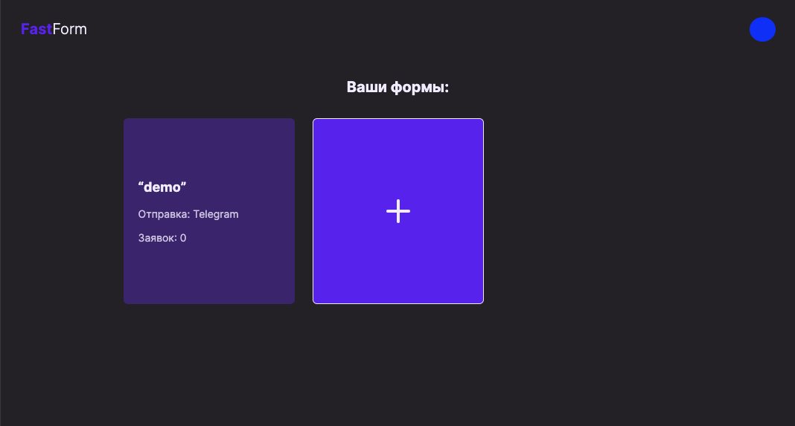
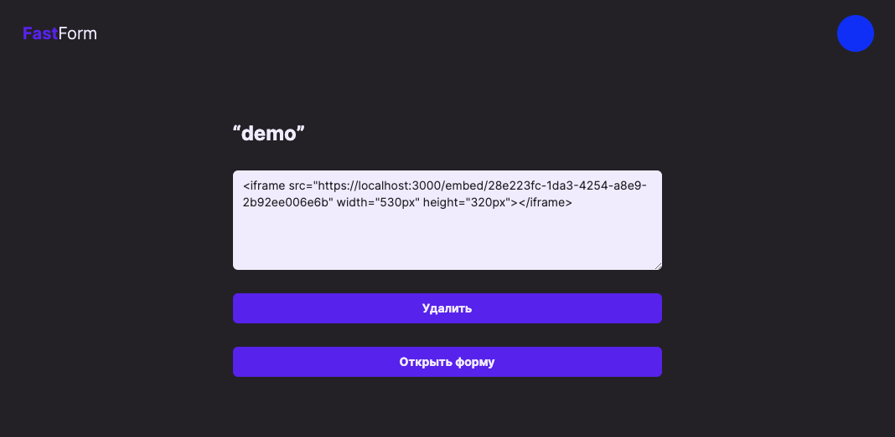
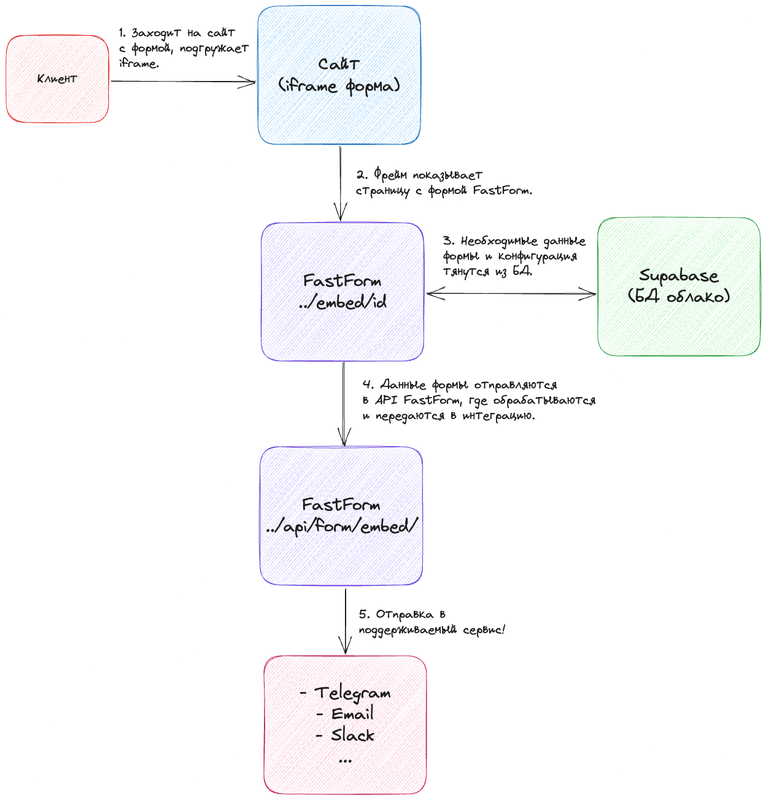

# fastform

Легкий конструктор html-форм для сбора пользовательских данных. Имеет простую панель управления с кастомизацией.

## Интеграции

-   [x] Telegram
-   [ ] Email
-   [ ] Slack
-   [ ] Discord
-   [ ] ???

## Интерфейс

## Архитектура

Ключевые технологии - [NextJS](https://nextjs.org/), [TypeScript](https://www.typescriptlang.org/), [React](https://react.dev/). В качестве СУБД используется [supabase](https://supabase.com/). Регистрация/Авторизация/Аутентификация управляется внешней системой [clerk](https://clerk.com/) и предоставленным SDK(middleware + components). Утилитарные CSS абстрации для UI(компонентов) - [TailwindCSS](https://tailwindcss.com/).

